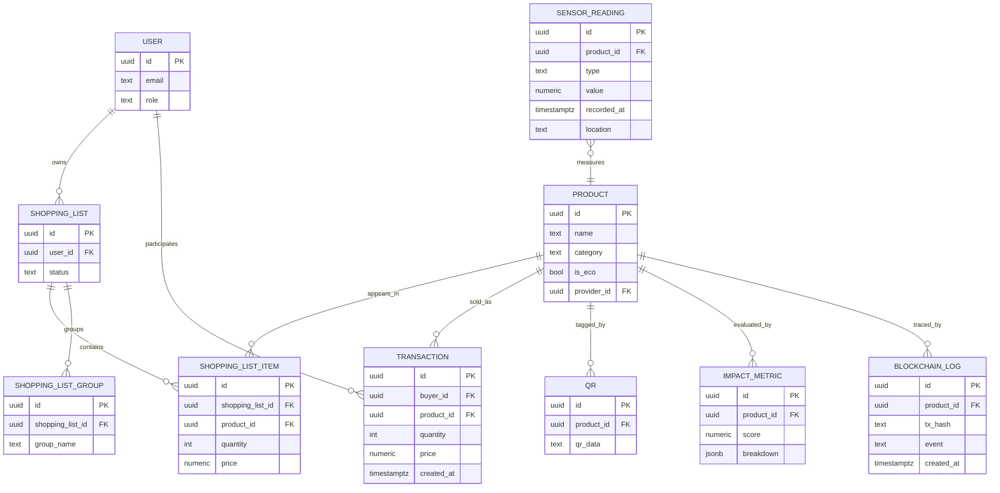

## Zero Platform — Documentación del Proyecto

### 1. Visión general
Zero Platform es una solución integral para la cadena alimentaria que integra:
- Frontend móvil Android para tres perfiles: consumidor, agricultor y supermercado.
- Backend API REST con FastAPI para datos de negocio, métricas e integración blockchain.
- Base de datos relacional (PostgreSQL) para persistencia.
- Módulos IoT (ESP32 y Raspberry Pi) para sensorización (inventario y temperatura).
- Contrato inteligente en Solidity para trazabilidad de productos.


### 2. Funcionalidades principales
- Autenticación y perfiles por rol (consumidor, agricultor, supermercado).
- Catálogo y detalle de productos; carrito y compras para consumidores.
- Gestión de inventario, pedidos y estadísticas para agricultores.
- Gestión de inventario y proveedores para supermercados.
- Lectura y registro de sensores (temperatura, inventario) desde IoT.
- Métricas de impacto (ambiental y social) y scoring de sostenibilidad.
- Trazabilidad blockchain de productos y transacciones.


### 3. Arquitectura del sistema
- Frontend: App Android nativa (Java) con `Fragments`, `RecyclerView` y `BottomNavigationView`.
- Backend: FastAPI (Python) con routers modulares v1, modelos Pydantic y SQLAlchemy.
- Base de datos: PostgreSQL (scripts en `database/`).
- IoT: Firmwares y scripts para sensores (ESP32 y Raspberry Pi).
- Blockchain: Contrato `ProductTraceability.sol` + gestor Web3 en backend.

Estructura a alto nivel:
```
frontend/           # App Android (Java)
backend/            # API FastAPI (Python)
database/           # Esquemas SQL, datos falsos y documentación BD
docs/               # Documentación adicional (arquitectura, algoritmos, flujo)
iot/                # Código y scripts para sensores (ESP32, Raspberry)
```


### 4. Frontend (Android)
Ruta: `frontend/app/src/main/java/com/example/frontend`

- `MainActivity.java`: punto de entrada. Selecciona flujo por tipo de usuario y gestiona el `BottomNavigationView` que navega entre fragments.
- `ui/auth`: `LoginFragment`, `RegisterFragment`.
- `ui/consumer`: `ConsumerProductsFragment`, `ConsumerPurchasesFragment`, `ConsumerProfileFragment`.
- `ui/farmer`: `FarmerStockFragment`, `FarmerOrdersFragment`, `FarmerStatisticsFragment`, `FarmerProfileFragment`, `FarmerOrderDetailsDialogFragment`, `FarmerSensorDetailsDialogFragment`.
- `ui/supermarket`: `SupermarketSuppliersFragment`, `SupermarketInventoryFragment`, `SupermarketProfileFragment`.
- `ui/fragments` reutilizables: `ProductDetailFragment`, `AddProductFragment`.
- `ui/adapters`: adaptadores de listas (`ProductAdapter`, `CartAdapter`, `FarmerOrderAdapter`, `FarmerStockAdapter`, `FarmerStatsAdapter`, `FarmerSensorAdapter`, `SupermarketOrderAdapter`, `SupermarketCartAdapter`, `SupplierProductAdapter`).

Flujo de navegación (simplificado):
```
MainActivity
 ├─ auth: Login/Register
 └─ consumer/farmer/supermarket → BottomNavigationView → Fragments por rol
```

Lenguaje y tooling:
- Java, Gradle (Kotlin DSL), AndroidX, Material Components.


### 5. Backend (API REST)
Ruta: `backend/app`

- Entrada: `main.py` con instancia `FastAPI` y registro de routers v1.
- Configuración: `core/config.py` (variables de entorno: `DATABASE_URL`, `SECRET_KEY`, `BLOCKCHAIN_URL`, `CONTRACT_ADDRESS`, etc.).
- Modelos de dominio: `models/` (e.g., `product.py`, `user.py`, `shopping_list.py`, `transaction.py`, `sensor_reading.py`, `blockchain_log.py`, `impact_metric.py`).
- Esquemas Pydantic: `schemas/` (pares 1:1 con `models/`).
- Routers v1: `api/v1/routers/` y endpoint específico `api/v1/endpoints/blockchain.py`.
- Algoritmos: `algorithms/` (gestión blockchain, cálculo de impactos, optimización de productos).
- Contratos: `contracts/ProductTraceability.sol` y ABI `ProductTraceability.json`.

Ejemplo de registro de routers en `main.py`:
```python
app.include_router(users.router)
app.include_router(products.router)
app.include_router(shopping_lists.router)
app.include_router(shopping_list_groups.router)
app.include_router(shopping_list_items.router)
app.include_router(transactions.router)
app.include_router(sensor_readings.router)
app.include_router(qrs.router)
app.include_router(blockchain_logs.router)
app.include_router(impact_metrics.router)
```

Algoritmos destacados (ver `docs/ALGORITHMS.md`):
- Cálculo de impacto ambiental y social; puntuación de sostenibilidad (0–100).
- Gestor de blockchain con Web3: registro y verificación de productos/transacciones.
- Optimización de productos (por impacto/coste/logística).


### 6. Base de datos
Ruta: `database/`

- Esquema y scripts: `database_schema.sql`, `drop_tables.sql`, `fake_data.sql`, `fake_data.py`.
- Documentación: `db.md` (actores, temas clave y comandos `psql`).
- Migraciones: `alembic/` (config en `alembic.ini`, versiones en `alembic/versions/`).

Entidades principales (según `models/` del backend):
- Usuarios (`user`), Productos (`product`), Listas de la compra (`shopping_list`, `shopping_list_item`, `shopping_list_group`).
- Transacciones (`transaction`), Lecturas de sensor (`sensor_reading`).
- Códigos QR (`qr`), Registros de blockchain (`blockchain_log`), Métricas de impacto (`impact_metric`).


### 7. Blockchain de trazabilidad
Ruta: `backend/app/contracts/ProductTraceability.sol` y `algorithms/blockchain_manager.py`

- Contrato inteligente para registrar productos y transacciones con historial inmutable.
- En backend, un `BlockchainManager` se conecta vía Web3 (URL por env) usando la dirección de contrato y el ABI.
- Casos de uso: registrar producto, registrar transacción, verificar autenticidad, consultar historial.

Variables de entorno relevantes:
```
BLOCKCHAIN_URL=http://localhost:8545
CONTRACT_ADDRESS=0x...    # Dirección del contrato desplegado
```


### 8. IoT (sensores)
Ruta: `iot/`

- `esp32/`: firmwares Arduino (`inventory_sensor.ino`, `temperature_monitor.ino`).
- `raspberry/`: script Python (`dht22_logger.py`) para capturar temperatura/humedad y enviar/registrar lecturas.
- Datos de ejemplo: `data/sensors/` con `locations.csv` y `readings.csv`.

Integración con backend:
- Lecturas publicadas y persistidas como `sensor_reading` vía endpoints.


### 9. Flujo Backend ↔ Frontend
Ver `docs/flujo_backend_frontend.md`.
- Frontend consume endpoints REST para autenticación, catálogo, pedidos, métricas, sensores y blockchain.
- El backend aplica validación, seguridad y orquesta cálculos/registro en blockchain.


### 10. Lenguajes y tecnologías
- Android: Java, Gradle, AndroidX, Material.
- Backend: Python 3.11, FastAPI, Pydantic, SQLAlchemy, Web3.py.
- Base de datos: PostgreSQL, Alembic para migraciones.
- Blockchain: Solidity, ABI JSON, Web3.
- IoT: C++ (Arduino), Python (Raspberry Pi).
- Contenedores y despliegue: `Dockerfile`, `docker-compose.yml`.


### 11. Configuración y variables de entorno (backend)
Archivo: `backend/app/core/config.py`
```
ENVIRONMENT=
DATABASE_URL=
SECRET_KEY=
DEBUG=
ALGORITHM=
ACCESS_TOKEN_EXPIRE_MINUTES=
BLOCKCHAIN_URL=
CONTRACT_ADDRESS=
```


### 12. Estructura de carpetas (resumen)
```
backend/
  app/
    main.py
    core/
    models/
    schemas/
    api/v1/
    algorithms/
    contracts/
database/
docs/
frontend/
  app/
    src/main/
      java/com/example/frontend/
        ui/{auth,consumer,farmer,supermarket,fragments,adapters}
iot/
```


### 13. Puesta en marcha

Backend (local):
```bash
cd backend
python -m venv .venv && source .venv/bin/activate  # Windows: .venv\Scripts\activate
pip install -r requirements.txt
python -m alembic upgrade head  # Desde la raíz del proyecto
uvicorn backend.app.main:app --reload
```

Base de datos:
```bash
# Variables de conexión en database/db.md
# Aplicar esquema y datos falsos si se desea
psql "<DATABASE_URL>" -f database/database_schema.sql
psql "<DATABASE_URL>" -f database/fake_data.sql
```

Frontend (Android):
1) Abrir `frontend/` en Android Studio.
2) Sincronizar Gradle y ejecutar en emulador/dispositivo.

Docker (opcional, si se proveen servicios):
```bash
docker-compose up -d
```


### 14. Seguridad
- Gestión de secretos vía variables de entorno (`SECRET_KEY`, tokens, claves blockchain).
- Control de acceso y validación en endpoints FastAPI.
- Separación de roles en frontend y backend.


### 15. Pruebas
- Backend: tests unitarios en `backend/tests/` y `tests/unit/` (algoritmos, logística, optimización, blockchain manager).
- Frontend: pruebas instrumentadas/esqueleto en `frontend/app/src/androidTest/` y unitarias en `frontend/app/src/test/`.


### 16. Documentación adicional
- `docs/ALGORITHMS.md`: detalles de algoritmos (impacto, blockchain, integración).
- `docs/arquitectura.md`: arquitectura general del sistema.
- `docs/flujo_backend_frontend.md`: flujo de datos y responsabilidades.
- `docs/trazabilidad_blockchain.md`: trazabilidad con blockchain.


### 17. Licencia
Ver `LICENSE` en la raíz del repositorio.


### Anexo A. Detalle técnico — App Android

Ruta base: `frontend/app/src/main/java/com/example/frontend`

1) Estructura de paquetes UI
- `ui/auth`: pantallas de acceso
  - `LoginFragment` y `RegisterFragment` gestionan formularios, validación local (UI) y navegación a `MainActivity`.
- `ui/consumer`, `ui/farmer`, `ui/supermarket`: paneles por rol
  - Cada paquete expone 2–4 `Fragment` que se inyectan en el contenedor principal mediante `BottomNavigationView`.
  - Diálogos especializados en farmer (`FarmerOrderDetailsDialogFragment`, `FarmerSensorDetailsDialogFragment`).
- `ui/fragments`: componentes reutilizables
  - `ProductDetailFragment` y `AddProductFragment` son llamados desde múltiples pantallas.
- `ui/adapters`: capa de presentación en listas
  - `RecyclerView.Adapter` para productos, carrito, pedidos, sensores, etc. Encapsulan `ViewHolder`, diffing (si aplica) y listeners.

2) Navegación y contenedor principal
- `MainActivity` levanta una pantalla de login simple (temporal) y, tras elegir rol, carga `activity_main` con:
  - `BottomNavigationView` → infla un menú distinto según `userType`.
  - `FragmentManager` → `replace(R.id.nav_host_fragment, selectedFragment)` al seleccionar cada ítem.
  - El primer ítem del menú se selecciona por defecto para montar el fragment inicial.

3) Flujo de datos típico en un listado (ej. `ConsumerProductsFragment`)
- Inicializa `RecyclerView` con `ProductAdapter`.
- Solicita datos (REST) — la app contiene paquetes `api/`, `model/`, `viewmodel/` y `utils/`:
  - `api/`: clientes HTTP (p. ej., Retrofit/OkHttp o análogo) para endpoints de `backend`.
  - `model/`: POJOs para mapear JSON ↔ objetos de dominio.
  - `viewmodel/`: orquesta el ciclo de vida y expone estado observable (LiveData) a los fragments.
  - `utils/`: helpers (formato, constantes, manejo de errores UI).
- Renderizado: el adapter bindea cada `Product` en el `ViewHolder` (nombre, precio, etiquetas eco, etc.) y maneja clicks (detalles, añadir al carrito).

4) Adaptadores y listas
- Adaptadores incluidos: `ProductAdapter`, `CartAdapter`, `FarmerOrderAdapter`, `FarmerStockAdapter`, `FarmerStatsAdapter`, `FarmerSensorAdapter`, `SupermarketOrderAdapter`, `SupermarketCartAdapter`, `SupplierProductAdapter`.
- Responsabilidades:
  - Inflar layout de ítem (XML en `res/layout/`).
  - Mapear datos a vistas (texto, imágenes, iconos, chips).
  - Propagar eventos al `Fragment` (callbacks/lambdas) para navegación o acciones.

5) Reutilización y diálogos
- `ProductDetailFragment`: muestra detalle y acciones (añadir al carrito, ver métricas, QR, etc.).
- `AddProductFragment`: formulario reutilizable para altas (usado por farmer/supermarket).
- Diálogos en farmer para granularidad sin abandonar el contexto de lista.

6) Recursos y estilos
- `res/layout`: pantallas, ítems de listas, diálogos. `res/drawable` y `res/mipmap` para gráficos; fuentes en `res/font`; temas en `res/values`.
- Material Design Components para consistencia visual.

7) DI y utilidades
- Existe paquete `di/` (sugiere Hilt/Dagger). Proporciona singletons para clientes HTTP, repositorios y config.
- `utils/` centraliza utilidades (logs, formato, validación).

8) Integración con backend
- Endpoints consumidos: usuarios, productos, listas de la compra, transacciones, lecturas de sensores, QR, blockchain logs, métricas de impacto.
- Manejo de errores: mensajes de UI y reintentos si aplica.


### Anexo B. Detalle técnico — Base de datos

1) Modelo conceptual (dominios principales)
- Usuarios (`user`): credenciales, perfil y rol.
- Productos (`product`): catálogo y metadatos (categoría, eco, proveedor/agricultor).
- Listas de la compra (`shopping_list`, `shopping_list_item`, `shopping_list_group`).
- Transacciones (`transaction`): compra/venta de productos entre actores.
- Lecturas de sensor (`sensor_reading`): telemetría de IoT (temperatura, cantidad, ubicaciones).
- Códigos QR (`qr`): vinculación de identificadores físicos y metadatos de producto/lote.
- Blockchain (`blockchain_log`): huellas/txid, eventos e historial on-chain.
- Métricas de impacto (`impact_metric`): huella ambiental y social por producto/lote.

2) Relaciones clave (ER en Mermaid)


3) Consideraciones de integridad y rendimiento
- Claves foráneas y `ON DELETE` según caso de negocio (p. ej., cascada en items de listas al borrar lista).
- Índices recomendados:
  - `product(category)`, `product(provider_id)` para catálogos y paneles de proveedor.
  - `shopping_list_item(shopping_list_id)`, `shopping_list_item(product_id)`.
  - `transaction(buyer_id, created_at desc)` para historiales.
  - `sensor_reading(product_id, recorded_at desc)` para telemetría reciente.
  - `blockchain_log(product_id, created_at desc)` y `blockchain_log(tx_hash)` único.
- Tipos apropiados: `uuid`, `numeric`, `jsonb` (para desglose de impacto), `timestamptz`.

4) Ciclo de datos end-to-end
- Creación/edición de `product` por farmer/supermarket → persistencia en DB → registro opcional en blockchain (`blockchain_log`).
- Consumidor compra → `transaction` y afectación de inventario; posible emisión de QR.
- Lecturas IoT → `sensor_reading` vinculadas a `product` o ubicación; disponibles para analítica/alertas.
- Cálculo de `impact_metric` vía algoritmos → guardado y exposición a frontend.

5) Migraciones y datos de ejemplo
- Alembic en `alembic/` y `alembic.ini`. Versiones en `alembic/versions/`.
- Scripts en `database/`: `database_schema.sql`, `fake_data.sql`, `fake_data.py`, `drop_tables.sql`.
- Comandos de `db.md` para aplicar esquema y datos a un PostgreSQL accesible vía URL.


